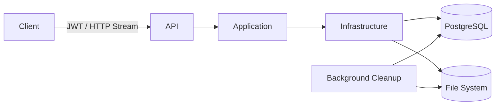
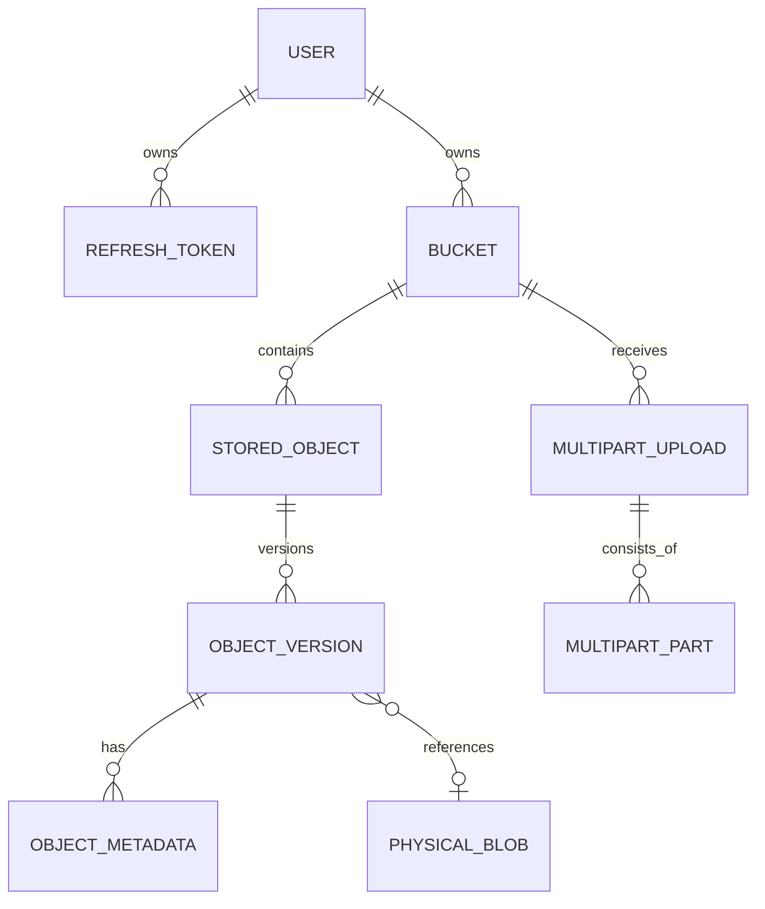
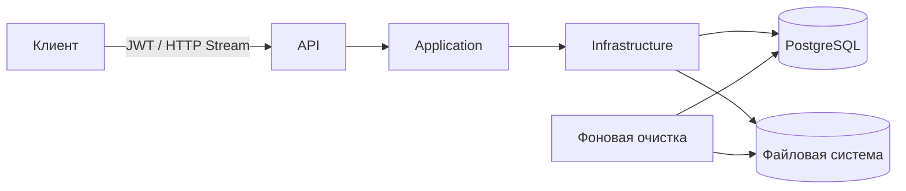

# SystemDesign.CloudStorage

Single-node S3-like object storage built with .NET 10. Supports streaming file operations, object versioning, multipart uploads, and PostgreSQL-based metadata storage.

**English** | [Русский](#русский)

---

## Overview

SystemDesign.CloudStorage is a single-node object storage service inspired by the core concepts of Amazon S3.

The service separates logical objects from their physical representation. Users, buckets, object keys, versions, metadata, and multipart upload state are stored in PostgreSQL, while object contents are stored as binary blobs in an external filesystem.

The project intentionally focuses on a single storage node and does not implement replication, sharding, consistent hashing, distributed consensus, or cluster coordination.

## Architecture



### Solution Structure

```text
SystemDesign.CloudStorage.Api
SystemDesign.CloudStorage.Application
SystemDesign.CloudStorage.Domain
SystemDesign.CloudStorage.Infrastructure
SystemDesign.CloudStorage.Persistence
SystemDesign.CloudStorage.Tests
```

- `Api` — REST API, Swagger, HTTP Range and conditional request handling.
- `Application` — contracts, DTOs, options, and application-level errors.
- `Domain` — users, buckets, logical objects, versions, blobs, and multipart models.
- `Infrastructure` — storage operations, JWT, filesystem access, concurrency control, quotas, and cleanup.
- `Persistence` — Entity Framework Core, PostgreSQL mappings, and migrations.
- `Tests` — unit and integration tests.

## Object Storage Model

An object is identified by:

```text
Owner + Bucket + Key
```

For example:

```text
Bucket: documents
Key: users/123/passport.pdf
```

The object key is a logical identifier. It is never used directly as a filesystem path.

A physical blob may be stored as:

```text
CloudStorage/
└── objects/
    └── dc/
        └── f9/
            └── dcf982d10b5045808c8a1cf5bb73558c.blob
```

This keeps the logical namespace completely independent from physical storage.

## Data Model



PostgreSQL acts as the storage catalog. Actual object contents are never stored in the database.

## Streaming I/O

Uploads and downloads are fully streamed.

```text
HTTP Request Stream
        │
        ▼
 Temporary File
        │
        ├── SHA-256 / ETag
        ▼
  Physical Blob
        │
        ▼
 PostgreSQL Metadata
```

Objects are not loaded entirely into `byte[]` or `MemoryStream`. Memory consumption is therefore bounded by the streaming buffer rather than object size.

Uploads are first written to temporary storage. After the stream has been successfully written and validated, the temporary file is promoted to a physical blob and its metadata is committed to PostgreSQL.

## Versioning

Every `PUT` to an existing `Bucket + Key` creates a new immutable object version.

```text
document.docx
│
├── Version 1 ──→ Blob 1
├── Version 2 ──→ Blob 2
└── Version 3 ──→ Blob 3
```

Each version has its own `VersionId`.

A regular `GET` returns the latest active version. A specific version can also be retrieved explicitly.

## Delete Markers

Deleting an object without specifying a version does not physically delete its previous versions.

Instead, a new delete-marker version is created:

```text
StoredObject
│
├── Version 1 ──→ PhysicalBlob
└── Version 2 ──→ DeleteMarker
```

The regular object lookup then returns `404`, while previous versions and their blobs remain available through their `VersionId`.

## Multipart Upload

Large objects can be uploaded in multiple independent parts:

```text
Initiate
   │
   ├── Upload Part 1
   ├── Upload Part 2
   ├── Upload Part 3
   │
   ▼
Complete
```

Each part is streamed into temporary storage and receives its own integrity information.

During completion, parts are validated and sequentially combined into the final blob without loading the entire object into memory.

Multipart upload is optional. Regular streaming `PUT` also supports large objects.

## HTTP Range and Conditional Requests

Downloads support HTTP byte ranges:

```http
Range: bytes=1048576-2097151
```

The service seeks directly to the requested position in the physical blob and returns only the requested range with `206 Partial Content`.

Also supported:

- `HEAD`
- `ETag`
- `If-Match`
- `If-None-Match`
- `Content-Range`
- `Accept-Ranges`

## Object Listing

Bucket contents can be queried using:

- prefix filtering;
- page size;
- continuation tokens;
- keyset pagination.

Filtering and pagination are performed by PostgreSQL rather than loading the entire bucket into application memory.

## Authentication

The API uses JWT Bearer authentication.

Supported operations include:

```text
Register
Login
Refresh
Revoke
```

Users can authenticate using either login/password or email/password.

Access tokens have a one-hour lifetime and are not persisted. Refresh tokens are cryptographically generated, while only their SHA-256 hashes are stored in PostgreSQL.

## Concurrency and Consistency

Concurrent writes to the same logical object are serialized using PostgreSQL transaction-level advisory locks based on:

```text
Owner + Bucket + Key
```

Writes to unrelated object keys do not require a global application lock.

Filesystem operations and PostgreSQL transactions cannot participate in the same atomic transaction. The storage therefore uses temporary files, atomic promotion, compensating deletion, and background orphan cleanup to maintain consistency.

## Background Cleanup

A background service periodically removes:

- abandoned multipart uploads;
- expired multipart parts;
- stale temporary files;
- orphan physical blobs that are no longer referenced.

Delete markers do not cause previous object versions to be removed.

## Storage Quotas

Configurable limits include:

```text
MaxObjectSize
MaxMultipartPartSize
MinMultipartPartSize
MaxParts
MaxBucketsPerUser
MaxStorageBytesPerUser
```

## Configuration

Physical object storage must be located outside the application and repository directories.

Example for Windows:

```json
{
  "Storage": {
    "RootPath": "D:\\CloudStorage"
  }
}
```

Example for Linux:

```text
/var/lib/systemdesign-cloudstorage
```

The service creates its internal storage directories automatically:

```text
CloudStorage/
├── objects/
├── temporary/
└── multipart/
```

## Running

Requirements:

- .NET 10 SDK
- PostgreSQL
- configured storage root
- JWT signing key

## Scope

SystemDesign.CloudStorage is intentionally designed for a single storage node.

The following distributed storage mechanisms are outside its current scope:

- replication;
- sharding;
- consistent hashing;
- erasure coding;
- cluster membership;
- distributed consensus;
- automatic rebalancing.

---

# Русский

Однонодовое S3-подобное объектное хранилище на .NET 10. Поддерживает потоковую работу с файлами, версионирование, multipart upload и хранение метаданных в PostgreSQL.

[English](#systemdesigncloudstorage) | **Русский**

## Обзор

SystemDesign.CloudStorage — однонодовое объектное хранилище, реализующее основные принципы S3.

Сервис разделяет логическое представление объектов и их физическое содержимое. Пользователи, buckets, ключи объектов, версии, метаданные и состояние multipart uploads хранятся в PostgreSQL, а содержимое объектов — в виде бинарных blobs во внешней файловой системе.

Архитектура намеренно рассчитана на одну storage-ноду и не включает репликацию, шардирование, consistent hashing, distributed consensus и координацию кластера.

## Архитектура



### Структура solution

```text
SystemDesign.CloudStorage.Api
SystemDesign.CloudStorage.Application
SystemDesign.CloudStorage.Domain
SystemDesign.CloudStorage.Infrastructure
SystemDesign.CloudStorage.Persistence
SystemDesign.CloudStorage.Tests
```

- `Api` — REST API, Swagger, HTTP Range и conditional requests.
- `Application` — контракты, DTO, options и прикладные ошибки.
- `Domain` — пользователи, buckets, логические объекты, версии, blobs и multipart-модели.
- `Infrastructure` — операции хранилища, JWT, файловая система, concurrency control, quotas и cleanup.
- `Persistence` — Entity Framework Core, mappings PostgreSQL и migrations.
- `Tests` — unit и integration tests.

## Модель хранения объектов

Объект идентифицируется комбинацией:

```text
Owner + Bucket + Key
```

Например:

```text
Bucket: documents
Key: users/123/passport.pdf
```

`Key` является логическим идентификатором и никогда напрямую не используется как путь файловой системы.

Физически blob может находиться:

```text
CloudStorage/
└── objects/
    └── dc/
        └── f9/
            └── dcf982d10b5045808c8a1cf5bb73558c.blob
```

Таким образом, логическое имя объекта полностью отделено от его физического расположения.

## Модель данных


PostgreSQL выполняет роль каталога object storage. Само содержимое объектов в базе данных не хранится.

## Потоковая работа с файлами

Upload и download выполняются потоково.

```text
HTTP Request Stream
        │
        ▼
 Temporary File
        │
        ├── SHA-256 / ETag
        ▼
  Physical Blob
        │
        ▼
 PostgreSQL Metadata
```

Объект не загружается целиком в `byte[]` или `MemoryStream`. Потребление памяти ограничивается streaming buffer и практически не зависит от размера файла.

При загрузке данные сначала записываются во временный файл. После успешного завершения записи файл переносится в постоянное blob storage, а информация об объекте и его версии сохраняется в PostgreSQL.

## Версионирование

Каждый повторный `PUT` существующего `Bucket + Key` создаёт новую immutable-версию:

```text
document.docx
│
├── Version 1 ──→ Blob 1
├── Version 2 ──→ Blob 2
└── Version 3 ──→ Blob 3
```

Каждая версия получает собственный `VersionId`.

Обычный `GET` возвращает последнюю активную версию. Конкретную версию можно получить отдельно по её `VersionId`.

## Delete Markers

Удаление объекта без указания версии не удаляет предыдущие версии физически.

Вместо этого создаётся новая версия с delete marker:

```text
StoredObject
│
├── Version 1 ──→ PhysicalBlob
└── Version 2 ──→ DeleteMarker
```

После этого обычный `GET` возвращает `404`, но предыдущие версии и соответствующие blobs продолжают существовать и доступны по `VersionId`.

## Multipart Upload

Крупные объекты могут загружаться отдельными частями:

```text
Initiate
   │
   ├── Upload Part 1
   ├── Upload Part 2
   ├── Upload Part 3
   │
   ▼
Complete
```

Каждая часть потоково сохраняется во временное хранилище и получает информацию для проверки целостности.

При `Complete` части проверяются и последовательно объединяются в final blob без загрузки всего объекта в память.

Multipart не является обязательным: обычный streaming `PUT` также поддерживает крупные файлы.

## HTTP Range и Conditional Requests

Download поддерживает HTTP Range:

```http
Range: bytes=1048576-2097151
```

Сервис выполняет seek непосредственно внутри физического blob и возвращает только запрошенный диапазон с `206 Partial Content`.

Также поддерживаются:

- `HEAD`;
- `ETag`;
- `If-Match`;
- `If-None-Match`;
- `Content-Range`;
- `Accept-Ranges`.

## Список объектов

Для просмотра содержимого bucket поддерживаются:

- prefix filtering;
- page size;
- continuation token;
- keyset pagination.

Фильтрация и pagination выполняются непосредственно PostgreSQL без загрузки всего списка объектов в память приложения.

## Аутентификация

API использует JWT Bearer Authentication.

Поддерживаются:

```text
Register
Login
Refresh
Revoke
```

Вход возможен по login/password или email/password.

Access token имеет lifetime один час и не сохраняется в БД. Refresh token генерируется криптографически безопасным способом, а в PostgreSQL сохраняется только его SHA-256 hash.

## Конкурентность и согласованность

Конкурентные записи одного logical object сериализуются с помощью PostgreSQL transaction-level advisory locks на основании:

```text
Owner + Bucket + Key
```

Операции над разными keys не требуют глобальной блокировки приложения.

PostgreSQL и файловая система не могут участвовать в общей атомарной транзакции. Для поддержания согласованности используются temporary files, atomic promotion, compensating deletion и фоновая очистка orphan blobs.

## Фоновая очистка

`BackgroundService` периодически очищает:

- abandoned multipart uploads;
- expired multipart parts;
- старые temporary files;
- orphan blobs, на которые больше не ссылаются версии объектов.

Наличие delete marker само по себе не приводит к удалению предыдущих версий объекта.

## Ограничения хранилища

Поддерживаются конфигурируемые лимиты:

```text
MaxObjectSize
MaxMultipartPartSize
MinMultipartPartSize
MaxParts
MaxBucketsPerUser
MaxStorageBytesPerUser
```

## Конфигурация

Физическое хранилище должно находиться вне каталога приложения и repository.

Пример для Windows:

```json
{
  "Storage": {
    "RootPath": "D:\\CloudStorage"
  }
}
```

Для Linux:

```text
/var/lib/systemdesign-cloudstorage
```

Сервис автоматически создаёт внутренние директории:

```text
CloudStorage/
├── objects/
├── temporary/
└── multipart/
```

## Запуск

Необходимы:

- .NET 10 SDK;
- PostgreSQL;
- настроенный `Storage:RootPath`;
- JWT signing key.

## Границы проекта

SystemDesign.CloudStorage рассчитан на одну storage-ноду.

Намеренно не реализованы:

- replication;
- sharding;
- consistent hashing;
- erasure coding;
- cluster membership;
- distributed consensus;
- automatic rebalancing.

Основное внимание уделено механизмам object storage внутри одной ноды: streaming I/O, versioning, physical blob storage, metadata, consistency, multipart uploads и lifecycle management.
